# Panduan Prompting AI untuk Mengisi Konten myITS Classroom
### Studi kasus: Pemrograman Web (ET234305) — Departemen Teknologi Informasi, ITS

Panduan ini berisi prompt siap pakai untuk setiap komponen **wajib/anjuran/kondisional** pada *Standar Baku Mutu Konten & Aktivitas Pembelajaran myITS Classroom (2026)*, lengkap dengan contoh hasil. Alur kerjanya: **tempel prompt ke AI (Claude/ChatGPT/dst) → tempel RPS sebagai lampiran/konteks → edit hasilnya → unggah ke myITS Classroom.**

> ⚠️ **Prinsip penting:** AI membantu menyusun draf dan mempercepat kerja, tapi dosen tetap wajib memverifikasi — terutama untuk referensi/pustaka (AI bisa mengarang judul/tautan), angka bobot penilaian, dan ketepatan materi teknis sebelum dipublikasikan ke mahasiswa.

---

## Daftar Isi

**A. Konten Wajib/Anjuran (Bagian 2.1)**
1. [Identitas & Informasi Umum Mata Kuliah](#1-identitas--informasi-umum-mata-kuliah)
2. [RPS](#2-rps-rencana-pembelajaran-semester)
3. [Kontrak Perkuliahan / Tata Tertib](#3-kontrak-perkuliahan--tata-tertib-kelas)
4. [Materi Pembelajaran per Pertemuan](#4-materi-pembelajaran-per-pertemuan)
5. [Referensi / Bacaan Tambahan](#5-referensi--bacaan-tambahan)
6. [Rubrik Penilaian](#6-rubrik-penilaian)
7. [Pengumuman](#7-pengumuman)
8. [Jadwal & Linimasa Perkuliahan](#8-jadwal--linimasa-perkuliahan)

**B. Aktivitas Pembelajaran (Bagian 2.2)**
9. [Forum Diskusi](#9-forum-diskusi)
10. [Penugasan (Assignment)](#10-penugasan-assignment)
11. [Kuis / Evaluasi Formatif](#11-kuis--evaluasi-formatif)
12. [Presensi Daring](#12-presensi-daring)
13. [ETS & EAS](#13-ets--eas)
14. [Sesi Sinkron (Live Session)](#14-sesi-sinkron-live-session)
15. [Survei / Umpan Balik](#15-survei--umpan-balik)

---

## A. Konten Wajib/Anjuran

### 1. Identitas & Informasi Umum Mata Kuliah

**Prompt:**
```
Saya dosen pengampu MK "Pemrograman Web" (ET234305) di Departemen Teknologi
Informasi ITS. Berikut RPS mata kuliah saya [tempel/lampirkan RPS].

Buatkan blok "Identitas & Informasi Umum Mata Kuliah" untuk halaman utama
myITS Classroom, mencakup: nama MK, kode, SKS, dosen pengampu, deskripsi
singkat (maks. 3 kalimat, bahasa mudah dipahami mahasiswa), dan format
kontak/jam konsultasi. Tulis dalam format yang siap tempel ke Moodle (teks
biasa, bukan HTML).
```

**Contoh hasil (HTML siap tempel ke Moodle):**
```html
<div style="background-color:#f7f5ef;border-radius:8px;padding:20px 22px;font-family:Arial, Helvetica, sans-serif;color:#0b1d3a;max-width:820px;">
  <div style="font-family:'Courier New', Courier, monospace;font-size:11px;letter-spacing:1px;text-transform:uppercase;color:#5b6b8c;margin-bottom:6px;">Identitas & Informasi Umum</div>
  <h2 style="font-size:18px;margin:0 0 12px;color:#0b1d3a;">Pemrograman Web (ET234305) &mdash; 4 SKS (T=3, P=1)</h2>
  <p style="font-size:14px;line-height:1.7;margin:0 0 10px;">
    <b>Dosen Pengampu:</b> Fuad Dary Rosyadi, S.Kom., M.Kom.</p>
    <p style="font-size:14px;line-height:1.7;margin:0 0 10px;">
    Mata kuliah ini membahas konsep, teknologi, dan keterampilan untuk mengembangkan aplikasi web
    modern &mdash; mulai dari HTML, CSS, dan JavaScript, hingga framework front-end/server-side,
    manajemen data, dan hosting. Mahasiswa akan berlatih membangun aplikasi web interaktif dan
    responsif melalui praktikum dan proyek CRUD.</p>
    <p style="font-size:13px;line-height:1.8;margin:0;">
    <span style="display:block;color:#5b6b8c;font-family:'Courier New',monospace;font-size:11px;text-transform:uppercase;">kontak &amp; jam konsultasi</span>
    [email@its.ac.id] &middot; [Hari, jam, ruang/tautan]</p>
</div>
```

**Preview tampilan di myITS Classroom:**

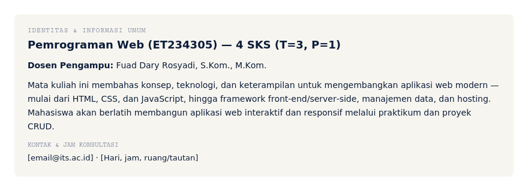

---

### 2. RPS (Rencana Pembelajaran Semester)

**Prompt:**
```
Berikut file RPS resmi MK Pemrograman Web [lampirkan PDF/DOCX RPS].

Tolong buatkan ringkasan RPS dalam bentuk poin-poin terstruktur untuk
ditampilkan di section pengantar myITS Classroom (bukan menggantikan
dokumen RPS aslinya, hanya ringkasan navigasi): CPL yang dibebankan, daftar
CPMK, daftar materi pembelajaran (bahan kajian), dan komponen evaluasi
beserta bobotnya. Format markdown dengan heading per bagian.
```

**Contoh hasil (HTML siap tempel ke Moodle):**
```html
<div style="background-color:#f7f5ef;border-radius:8px;padding:20px 22px;font-family:Arial, Helvetica, sans-serif;color:#0b1d3a;max-width:820px;">
  <div style="font-family:'Courier New', Courier, monospace;font-size:11px;letter-spacing:1px;text-transform:uppercase;color:#5b6b8c;margin-bottom:6px;">Ringkasan RPS</div>
  <h2 style="font-size:18px;margin:0 0 12px;color:#0b1d3a;">Pemrograman Web</h2>
  <p style="font-size:14px;margin:0 0 8px;"><b>CPL yang dibebankan:</b> CPL-3 &mdash; Mampu menyelesaikan masalah dengan mengimplementasikan TIK, memperhatikan prinsip keberlanjutan, serta memahami kewirausahaan berbasis teknologi.</p>
    <p style="font-size:14px;margin:12px 0 6px;"><b>CPMK:</b></p>
    <table style="width:100%;border-collapse:collapse;font-size:13px;">
      <tr><td style="padding:4px 8px 4px 0;width:80px;"><span style="font-family:'Courier New',monospace;font-size:11px;background-color:#0b1d3a;color:#4fd6d6;padding:2px 8px;border-radius:5px;">CPMK-1</span></td><td style="padding:4px 0;">Menjelaskan konsep pemrograman web (bobot 10%)</td></tr>
      <tr><td style="padding:4px 8px 4px 0;"><span style="font-family:'Courier New',monospace;font-size:11px;background-color:#0b1d3a;color:#4fd6d6;padding:2px 8px;border-radius:5px;">CPMK-2</span></td><td style="padding:4px 0;">Menganalisis permasalahan dengan pendekatan web (bobot 40%)</td></tr>
      <tr><td style="padding:4px 8px 4px 0;"><span style="font-family:'Courier New',monospace;font-size:11px;background-color:#0b1d3a;color:#4fd6d6;padding:2px 8px;border-radius:5px;">CPMK-3</span></td><td style="padding:4px 0;">Memodelkan solusi dengan pendekatan aplikasi web (bobot 40%)</td></tr>
      <tr><td style="padding:4px 8px 4px 0;"><span style="font-family:'Courier New',monospace;font-size:11px;background-color:#0b1d3a;color:#4fd6d6;padding:2px 8px;border-radius:5px;">CPMK-4</span></td><td style="padding:4px 0;">Mengimplementasikan &amp; menghosting aplikasi web (bobot 10%)</td></tr>
    </table>
    <p style="font-size:14px;margin:14px 0 6px;"><b>Bahan Kajian:</b></p>
    <p style="font-size:13px;line-height:1.8;margin:0 0 12px;">HTML &middot; CSS &middot; Bootstrap &middot; JavaScript &middot; DOM &middot; AJAX &middot; Vue.js &middot; Hosting &middot; Front-End &middot; Back-End &middot; CRUD &middot; Data &amp; Query &middot; Report</p>
    <p style="font-size:14px;margin:0 0 6px;"><b>Komponen Evaluasi:</b> Tugas 1 (30%) &middot; ETS (20%) &middot; Tugas 2 (25%) &middot; EAS (25%)</p>
    <p style="font-size:13px;margin:10px 0 0;">&#128196; Dokumen RPS lengkap: [tautan/file RPS]</p>
</div>
```

**Preview tampilan di myITS Classroom:**

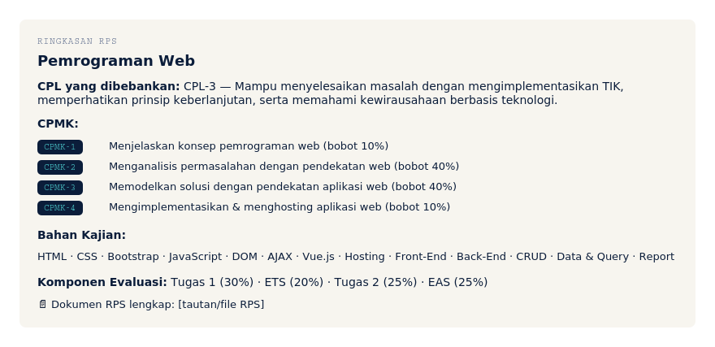

---

### 3. Kontrak Perkuliahan / Tata Tertib Kelas

**Prompt:**
```
Buatkan draf kontrak perkuliahan / tata tertib kelas untuk MK Pemrograman
Web di ITS (kelas dengan komponen praktikum), mencakup: aturan kehadiran,
etika kelas, kebijakan keterlambatan pengumpulan tugas/source code, dan
sanksi akademik (pelanggaran integritas akademik/plagiarisme kode).
Gaya bahasa formal tapi tidak kaku, maksimal 6 poin, siap tempel ke
myITS Classroom.
```

**Contoh hasil (HTML siap tempel ke Moodle):**
```html
<div style="background-color:#f7f5ef;border-radius:8px;padding:20px 22px;font-family:Arial, Helvetica, sans-serif;color:#0b1d3a;max-width:820px;">
  <div style="font-family:'Courier New', Courier, monospace;font-size:11px;letter-spacing:1px;text-transform:uppercase;color:#5b6b8c;margin-bottom:6px;">Kontrak Perkuliahan</div>
  <h2 style="font-size:18px;margin:0 0 12px;color:#0b1d3a;">Tata Tertib Kelas</h2>
  <ol style="font-size:14px;line-height:1.9;margin:0;padding-left:20px;">
    <li>Kehadiran minimal 80% dari total pertemuan (termasuk praktikum) untuk dapat mengikuti EAS.</li>
    <li>Toleransi keterlambatan masuk kelas/praktikum: 15 menit.</li>
    <li>Tugas dan source code dikumpulkan melalui myITS Classroom sebelum tenggat; keterlambatan dikenai pengurangan nilai 5% per hari, maksimal 3 hari.</li>
    <li>Laptop wajib dibawa saat sesi praktikum.</li>
    <li>Plagiarisme kode (menyalin penuh milik orang lain tanpa modifikasi/pemahaman) diproses sesuai peraturan akademik ITS.</li>
    <li>Pertanyaan teknis di luar jam kelas disampaikan melalui forum diskusi, dijawab maksimal 2x24 jam kerja.</li>
    </ol>
</div>
```

**Preview tampilan di myITS Classroom:**

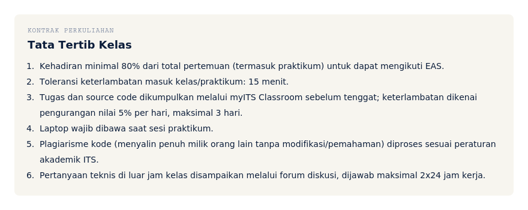

---

### 4. Materi Pembelajaran per Pertemuan

**Prompt:**
```
Berdasarkan RPS minggu ke-6 dengan topik "Membuat Aplikasi Web dengan
JavaScript dan DOM" (sub-CPMK: mahasiswa mampu mengimplementasikan
JavaScript dan DOM untuk membuat aplikasi web), buatkan outline
materi/slide untuk pertemuan ini: judul section Moodle, 4-6 subtopik
berurutan, dan 1 poin diskusi pemantik di akhir. Format markdown dengan
heading.
```

**Contoh hasil (HTML siap tempel ke Moodle):**
```html
<div style="background-color:#f7f5ef;border-radius:8px;padding:20px 22px;font-family:Arial, Helvetica, sans-serif;color:#0b1d3a;max-width:820px;">
  <div style="font-family:'Courier New', Courier, monospace;font-size:11px;letter-spacing:1px;text-transform:uppercase;color:#5b6b8c;margin-bottom:6px;">Materi Pembelajaran</div>
  <h2 style="font-size:18px;margin:0 0 12px;color:#0b1d3a;">Pertemuan 6 &mdash; Membuat Aplikasi Web dengan JavaScript &amp; DOM</h2>
  <ol style="font-size:14px;line-height:1.9;margin:0 0 12px;padding-left:20px;">
    <li>Recap: sintaks dasar JavaScript dan struktur DOM</li>
    <li>Manipulasi elemen DOM (selecting, modifying, event listener)</li>
    <li>Menghubungkan JavaScript dengan elemen HTML/CSS</li>
    <li>Studi kasus: membuat form interaktif dengan validasi sederhana</li>
    <li>Hands-on praktikum: aplikasi web sederhana berbasis JavaScript &amp; DOM</li>
    </ol>
    <div style="background-color:#0b1d3a;color:#fff;padding:12px 16px;border-radius:6px;font-size:13px;line-height:1.6;margin-bottom:10px;">
    <b style="color:#4fd6d6;">Poin diskusi:</b> Kapan sebaiknya manipulasi DOM dilakukan langsung dengan JavaScript murni, dan kapan sebaiknya menggunakan framework seperti Vue.js?</div>
    <p style="font-size:13px;margin:0;">&#128206; Sumber belajar: [slide/PDF pertemuan 6], [modul praktikum JavaScript &amp; DOM]</p>
</div>
```

**Preview tampilan di myITS Classroom:**

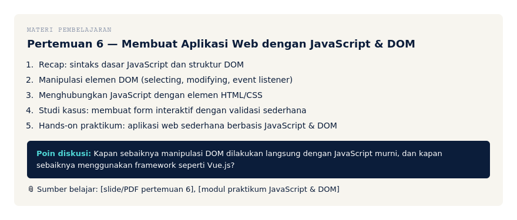

---

### 5. Referensi & Bacaan Tambahan

**Prompt:**
```
Untuk topik "JavaScript dan DOM" pada MK Pemrograman Web, sarankan 3
kategori referensi tambahan (dokumentasi resmi, artikel/tutorial teknis,
dan studi kasus industri) beserta alasan singkat relevansinya. JANGAN
mengarang judul/penulis/tautan spesifik — beri kategori dan kata kunci
pencarian saja agar saya cari & verifikasi sendiri sumber aslinya.
```

**Contoh hasil (HTML siap tempel ke Moodle):**
```html
<div style="background-color:#f7f5ef;border-radius:8px;padding:20px 22px;font-family:Arial, Helvetica, sans-serif;color:#0b1d3a;max-width:820px;">
  <div style="font-family:'Courier New', Courier, monospace;font-size:11px;letter-spacing:1px;text-transform:uppercase;color:#5b6b8c;margin-bottom:6px;">Referensi &amp; Bacaan Tambahan</div>
  <h2 style="font-size:18px;margin:0 0 12px;color:#0b1d3a;">JavaScript &amp; DOM</h2>
  <ol style="font-size:14px;line-height:1.9;margin:0 0 10px;padding-left:20px;">
    <li><b>Dokumentasi resmi</b> &mdash; cari: "MDN Web Docs JavaScript DOM manipulation" &rarr; acuan sintaks &amp; API DOM yang selalu diperbarui.</li>
    <li><b>Artikel/tutorial teknis</b> &mdash; cari: "JavaScript DOM event handling best practices" &rarr; pola penulisan kode yang lebih rapi.</li>
    <li><b>Studi kasus industri</b> &mdash; cari studi kasus performa web (mis. penggunaan Vanilla JS vs framework) di blog engineering perusahaan teknologi &rarr; konteks penerapan nyata.</li>
    </ol>
    <div style="background-color:#fff3d6;border-left:3px solid #ffb020;padding:8px 12px;font-size:12px;color:#6b5300;">&#9888; Semua judul, penulis, dan tautan perlu dicari &amp; diverifikasi manual sebelum dicantumkan ke myITS Classroom.</div>
</div>
```

**Preview tampilan di myITS Classroom:**

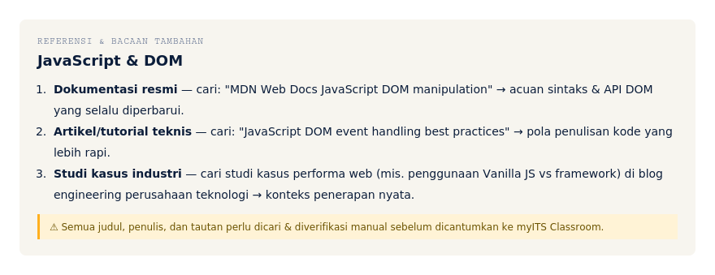

---

### 6. Rubrik Penilaian

**Prompt:**
```
Buatkan rubrik penilaian untuk Tugas 2 MK Pemrograman Web (topik: aplikasi
web sederhana dengan CRUD, bobot 25% dari nilai akhir). 4 kriteria
penilaian, 4 level capaian (Kurang/Cukup/Baik/Sangat Baik), dan bobot
skor tiap kriteria. Format tabel markdown.
```

**Contoh hasil (HTML siap tempel ke Moodle):**
```html
<div style="background-color:#f7f5ef;border-radius:8px;padding:20px 22px;font-family:Arial, Helvetica, sans-serif;color:#0b1d3a;max-width:820px;">
  <div style="font-family:'Courier New', Courier, monospace;font-size:11px;letter-spacing:1px;text-transform:uppercase;color:#5b6b8c;margin-bottom:6px;">Rubrik Penilaian</div>
  <h2 style="font-size:18px;margin:0 0 12px;color:#0b1d3a;">Tugas 2 &mdash; Aplikasi Web CRUD (Bobot 25%)</h2>
  <table border="1" cellpadding="7" cellspacing="0" style="width:100%;border-collapse:collapse;font-size:12px;border-color:#e3ded0;">
    <tr style="background-color:#0b1d3a;"><th style="color:#fff;text-align:left;font-family:'Courier New',monospace;font-size:11px;">Kriteria</th><th style="color:#fff;text-align:left;font-family:'Courier New',monospace;font-size:11px;">Bobot</th><th style="color:#fff;text-align:left;font-family:'Courier New',monospace;font-size:11px;">Kurang (1)</th><th style="color:#fff;text-align:left;font-family:'Courier New',monospace;font-size:11px;">Cukup (2)</th><th style="color:#fff;text-align:left;font-family:'Courier New',monospace;font-size:11px;">Baik (3)</th><th style="color:#fff;text-align:left;font-family:'Courier New',monospace;font-size:11px;">Sangat Baik (4)</th></tr>
    <tr><td>Fungsionalitas CRUD lengkap</td><td>35%</td><td>&lt;2 fungsi jalan</td><td>2&ndash;3 fungsi jalan</td><td>Semua fungsi jalan</td><td>Semua fungsi jalan + validasi input</td></tr>
    <tr style="background-color:#fff;"><td>Struktur kode &amp; database</td><td>25%</td><td>Tidak terstruktur</td><td>Cukup terstruktur</td><td>Terstruktur rapi</td><td>Terstruktur &amp; mengikuti best practice</td></tr>
    <tr><td>Tampilan front-end</td><td>20%</td><td>Tidak responsif</td><td>Sebagian responsif</td><td>Responsif</td><td>Responsif &amp; estetik</td></tr>
    <tr style="background-color:#fff;"><td>Ketepatan waktu</td><td>20%</td><td>Terlambat &gt;3 hari</td><td>Terlambat 1&ndash;3 hari</td><td>Tepat waktu</td><td>Lebih awal</td></tr>
    </table>
</div>
```

**Preview tampilan di myITS Classroom:**

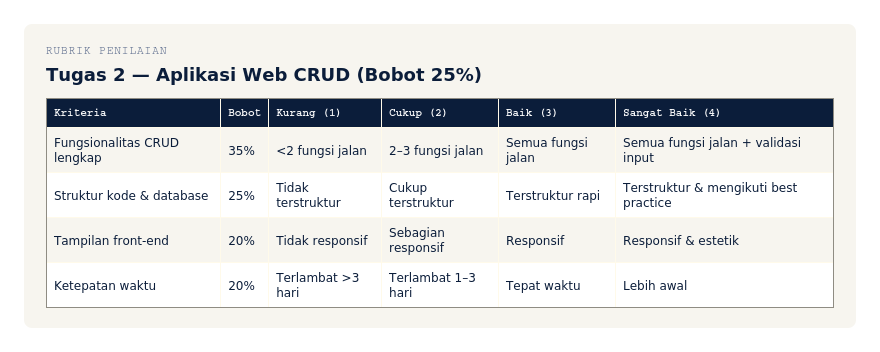

---

### 7. Pengumuman

**Prompt:**
```
Buatkan draf pengumuman untuk forum Announcement myITS Classroom MK
Pemrograman Web, isinya: pengingat tenggat Tugas 1 (H-3, proyek halaman
web HTML & CSS), nada profesional tapi ramah, sertakan poin teknis apa
saja yang wajib ada dalam proyek. Maksimal 100 kata.
```

**Contoh hasil (HTML siap tempel ke Moodle):**
```html
<div style="background-color:#f7f5ef;border-radius:8px;padding:20px 22px;font-family:Arial, Helvetica, sans-serif;color:#0b1d3a;max-width:820px;">
  <div style="font-family:'Courier New', Courier, monospace;font-size:11px;letter-spacing:1px;text-transform:uppercase;color:#5b6b8c;margin-bottom:6px;">Pengumuman</div>
  <h2 style="font-size:18px;margin:0 0 12px;color:#0b1d3a;">&#128226; Pengingat: Tenggat Tugas 1 &mdash; 3 Hari Lagi</h2>
  <p style="font-size:14px;line-height:1.7;margin:0;">
    Halo semua, Tugas 1 (Membuat Halaman Web Sederhana dengan HTML &amp; CSS) akan ditutup pada
    [tanggal, jam]. Pastikan proyek kalian memuat: (1) struktur HTML semantik,
    (2) styling CSS (layout, warna, tipografi), (3) tampilan responsif dasar,
    dan (4) source code rapi dengan komentar. Unggah dalam format ZIP/repository
    melalui menu Assignment di myITS Classroom.<br><br>
    Ada kendala? Silakan tulis di Forum Diskusi ya. Semangat coding! &#128187;</p>
</div>
```

**Preview tampilan di myITS Classroom:**

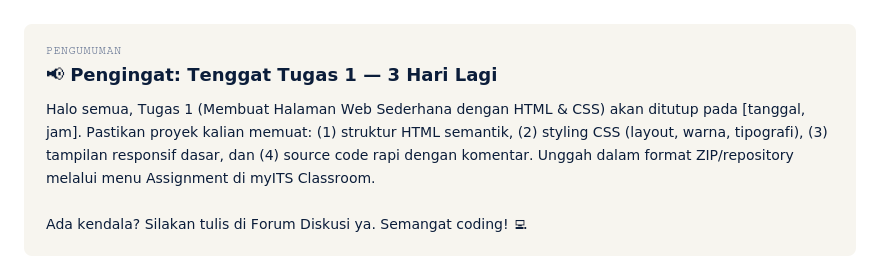

---

### 8. Jadwal & Linimasa Perkuliahan

**Prompt:**
```
Berdasarkan RPS 16 minggu MK Pemrograman Web [lampirkan RPS], susun tabel
linimasa yang menandai minggu mana saja ada tenggat tugas/ujian beserta
bobotnya, untuk ditempel di section pengantar myITS Classroom. Format
tabel markdown.
```

**Contoh hasil (HTML siap tempel ke Moodle):**
```html
<div style="background-color:#f7f5ef;border-radius:8px;padding:20px 22px;font-family:Arial, Helvetica, sans-serif;color:#0b1d3a;max-width:820px;">
  <div style="font-family:'Courier New', Courier, monospace;font-size:11px;letter-spacing:1px;text-transform:uppercase;color:#5b6b8c;margin-bottom:6px;">Jadwal &amp; Linimasa</div>
  <h2 style="font-size:18px;margin:0 0 12px;color:#0b1d3a;">Linimasa Tugas &amp; Ujian</h2>
  <table border="1" cellpadding="8" cellspacing="0" style="width:100%;border-collapse:collapse;font-size:13px;border-color:#e3ded0;">
    <tr style="background-color:#0b1d3a;"><th style="color:#fff;text-align:left;font-family:'Courier New',monospace;font-size:11px;">Minggu</th><th style="color:#fff;text-align:left;font-family:'Courier New',monospace;font-size:11px;">Aktivitas</th><th style="color:#fff;text-align:left;font-family:'Courier New',monospace;font-size:11px;">Bobot</th></tr>
    <tr><td>2</td><td>Tugas 1 dibuka (HTML)</td><td><span style="font-family:'Courier New',monospace;font-size:11px;background-color:#0b1d3a;color:#4fd6d6;padding:2px 8px;border-radius:5px;">10%</span></td></tr>
    <tr style="background-color:#fff;"><td>3</td><td>Tugas 1 lanjutan (CSS)</td><td><span style="font-family:'Courier New',monospace;font-size:11px;background-color:#0b1d3a;color:#4fd6d6;padding:2px 8px;border-radius:5px;">10%</span></td></tr>
    <tr><td>6</td><td>Tugas 1 ditutup (JS &amp; DOM)</td><td><span style="font-family:'Courier New',monospace;font-size:11px;background-color:#0b1d3a;color:#4fd6d6;padding:2px 8px;border-radius:5px;">10%</span></td></tr>
    <tr style="background-color:#fff;"><td>8</td><td>ETS (Evaluasi 1)</td><td><span style="font-family:'Courier New',monospace;font-size:11px;background-color:#ffb020;color:#0b1d3a;padding:2px 8px;border-radius:5px;">20%</span></td></tr>
    <tr><td>13</td><td>Tugas 2 ditutup (CRUD)</td><td><span style="font-family:'Courier New',monospace;font-size:11px;background-color:#0b1d3a;color:#4fd6d6;padding:2px 8px;border-radius:5px;">25%</span></td></tr>
    <tr style="background-color:#fff;"><td>16</td><td>EAS (Evaluasi 2)</td><td><span style="font-family:'Courier New',monospace;font-size:11px;background-color:#ffb020;color:#0b1d3a;padding:2px 8px;border-radius:5px;">25%</span></td></tr>
    </table>
</div>
```

**Preview tampilan di myITS Classroom:**

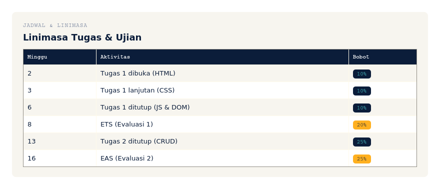

---

## B. Aktivitas Pembelajaran

### 9. Forum Diskusi

**Prompt:**
```
Buatkan 1 topik forum diskusi untuk materi "JavaScript dan DOM" (minggu
5–6), berupa 1 pertanyaan pemantik utama + 2 sub-pertanyaan pendukung
yang mendorong mahasiswa berargumen, bukan sekadar menjawab definisi.
```

**Contoh hasil (HTML siap tempel ke Moodle):**
```html
<div style="background-color:#f7f5ef;border-radius:8px;padding:20px 22px;font-family:Arial, Helvetica, sans-serif;color:#0b1d3a;max-width:820px;">
  <div style="font-family:'Courier New', Courier, monospace;font-size:11px;letter-spacing:1px;text-transform:uppercase;color:#5b6b8c;margin-bottom:6px;">Forum Diskusi</div>
  <h2 style="font-size:18px;margin:0 0 12px;color:#0b1d3a;">&#128187; Diskusi Minggu 5&ndash;6 &mdash; JavaScript &amp; DOM</h2>
  <p style="font-size:14px;line-height:1.7;margin:0 0 10px;"><b>Pertanyaan utama:</b> Dalam kasus apa memanipulasi DOM langsung dengan JavaScript lebih masuk akal dibanding memakai framework seperti Vue.js, dan sebaliknya?</p>
    <ul style="font-size:14px;line-height:1.8;margin:0 0 10px;padding-left:20px;">
    <li>Sub-pertanyaan 1: Apa risiko performa jika manipulasi DOM dilakukan berlebihan tanpa framework?</li>
    <li>Sub-pertanyaan 2: Fitur reactive data binding pada framework menyelesaikan masalah apa yang sulit ditangani JavaScript murni?</li>
    </ul>
    <p style="font-size:13px;color:#5b6b8c;margin:0;">Balas minimal 1 argumen orisinal + 1 tanggapan ke argumen teman sekelas.</p>
</div>
```

**Preview tampilan di myITS Classroom:**

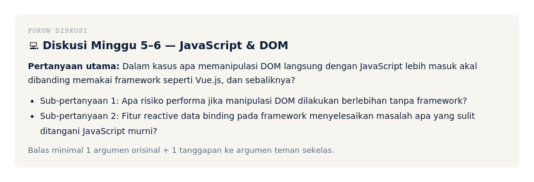

---

### 10. Penugasan (Assignment)

**Prompt:**
```
Buatkan instruksi lengkap Tugas 1 MK Pemrograman Web (topik: halaman web
sederhana dengan HTML & CSS, bobot 30%), mencakup: deskripsi tugas,
format pengumpulan, dan tenggat. Gunakan rubrik penilaian yang sudah
dibuat sebelumnya sebagai acuan kriteria.
```

**Contoh hasil (HTML siap tempel ke Moodle):**
```html
<div style="background-color:#f7f5ef;border-radius:8px;padding:20px 22px;font-family:Arial, Helvetica, sans-serif;color:#0b1d3a;max-width:820px;">
  <div style="font-family:'Courier New', Courier, monospace;font-size:11px;letter-spacing:1px;text-transform:uppercase;color:#5b6b8c;margin-bottom:6px;">Penugasan (Assignment)</div>
  <h2 style="font-size:18px;margin:0 0 12px;color:#0b1d3a;">&#128204; Tugas 1 &mdash; Halaman Web Sederhana dengan HTML &amp; CSS (Bobot: 30%)</h2>
  <p style="font-size:14px;line-height:1.7;margin:0 0 10px;"><b>Deskripsi:</b><br>
    Bangun 1 halaman web profil/portofolio sederhana menggunakan HTML dan CSS murni (boleh
    memanfaatkan Bootstrap pada bagian layout). Halaman wajib memuat: header/navigasi,
    bagian konten utama (minimal 2 section), dan footer, dengan tampilan responsif dasar
    (desktop &amp; mobile).</p>
    <p style="font-size:13px;line-height:1.8;margin:0;">
    <span style="display:block;color:#5b6b8c;font-family:'Courier New',monospace;font-size:11px;text-transform:uppercase;">format pengumpulan</span>ZIP source code atau tautan repository, melalui menu Assignment.<br><br>
    <span style="display:block;color:#5b6b8c;font-family:'Courier New',monospace;font-size:11px;text-transform:uppercase;">tenggat</span>[tanggal, jam] &mdash; minggu ke-6.<br><br>
    <span style="display:block;color:#5b6b8c;font-family:'Courier New',monospace;font-size:11px;text-transform:uppercase;">penilaian</span>mengikuti rubrik 4 kriteria pada tugas terkait.</p>
</div>
```

**Preview tampilan di myITS Classroom:**

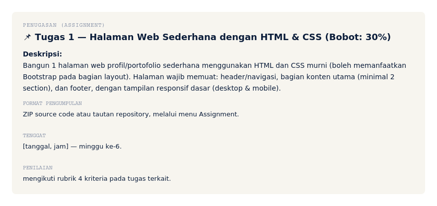

---

### 11. Kuis / Evaluasi Formatif

**Prompt:**
```
Buatkan 5 soal pilihan ganda untuk kuis formatif topik "Dasar HTML dan
CSS", tingkat kesulitan menengah, sertakan kunci jawaban dan penjelasan
singkat tiap jawaban.
```

**Contoh hasil (HTML siap tempel ke Moodle):**
```html
<div style="background-color:#f7f5ef;border-radius:8px;padding:20px 22px;font-family:Arial, Helvetica, sans-serif;color:#0b1d3a;max-width:820px;">
  <div style="font-family:'Courier New', Courier, monospace;font-size:11px;letter-spacing:1px;text-transform:uppercase;color:#5b6b8c;margin-bottom:6px;">Kuis / Evaluasi Formatif</div>
  <h2 style="font-size:18px;margin:0 0 12px;color:#0b1d3a;">Kuis &mdash; Dasar HTML &amp; CSS</h2>
  <div style="font-size:14px;line-height:1.8;margin-bottom:14px;">
    <b>1. Tag HTML yang tepat untuk membuat daftar bernomor adalah...</b><br>
    a) &lt;ul&gt; &nbsp; b) &lt;ol&gt; &nbsp; c) &lt;li&gt; &nbsp; d) &lt;dl&gt;<br>
    <span style="color:#1a7a4c;"><b>Jawaban: b</b> &mdash; &lt;ol&gt; (ordered list) menghasilkan daftar bernomor.</span>
    </div>
    <div style="font-size:14px;line-height:1.8;margin-bottom:14px;">
    <b>2. Properti CSS untuk mengatur jarak antar elemen di dalam border adalah...</b><br>
    a) margin &nbsp; b) padding &nbsp; c) gap &nbsp; d) spacing<br>
    <span style="color:#1a7a4c;"><b>Jawaban: b</b> &mdash; padding mengatur jarak di dalam elemen, margin di luar elemen.</span>
    </div>
    <p style="font-size:13px;color:#5b6b8c;margin:0;">(dst. &mdash; total 5 soal dengan pola serupa)</p>
</div>
```

**Preview tampilan di myITS Classroom:**

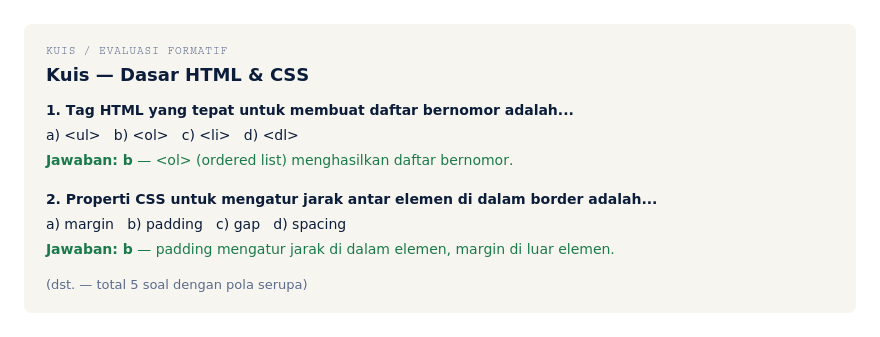

---

### 12. Presensi Daring

**Prompt:**
```
Buatkan draf kebijakan singkat presensi daring untuk dicantumkan di
myITS Classroom: cara presensi (modul Attendance), batas waktu presensi
dibuka per sesi kuliah/praktikum, dan konsekuensi jika tidak presensi.
```

**Contoh hasil (HTML siap tempel ke Moodle):**
```html
<div style="background-color:#f7f5ef;border-radius:8px;padding:20px 22px;font-family:Arial, Helvetica, sans-serif;color:#0b1d3a;max-width:820px;">
  <div style="font-family:'Courier New', Courier, monospace;font-size:11px;letter-spacing:1px;text-transform:uppercase;color:#5b6b8c;margin-bottom:6px;">Presensi Daring</div>
  <h2 style="font-size:18px;margin:0 0 12px;color:#0b1d3a;">&#128203; Kebijakan Presensi</h2>
  <p style="font-size:14px;line-height:1.7;margin:0;">
    Presensi dilakukan melalui modul Attendance di myITS Classroom, dibuka
    15 menit sebelum sesi kuliah/praktikum dimulai hingga 15 menit setelah sesi
    berakhir. Mahasiswa yang tidak presensi dalam rentang waktu tersebut dianggap
    tidak hadir kecuali ada konfirmasi tertulis (sakit/izin) maksimal 2x24 jam
    setelah sesi.</p>
</div>
```

**Preview tampilan di myITS Classroom:**

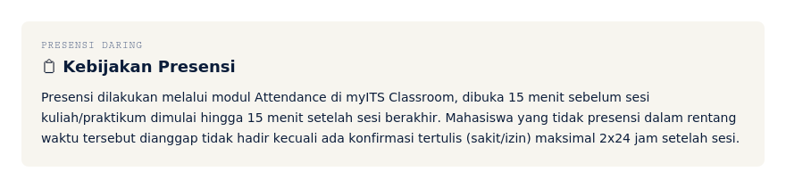

---

### 13. ETS & EAS

**Prompt:**
```
Berdasarkan CPMK-1 dan CPMK-2 (materi minggu 1–7) MK Pemrograman Web,
buatkan kisi-kisi ETS (tabel: minggu, materi, bentuk soal) dan 2 contoh
soal yang mengukur pemahaman konsep + penerapan praktik.
```

**Contoh hasil (HTML siap tempel ke Moodle):**
```html
<div style="background-color:#f7f5ef;border-radius:8px;padding:20px 22px;font-family:Arial, Helvetica, sans-serif;color:#0b1d3a;max-width:820px;">
  <div style="font-family:'Courier New', Courier, monospace;font-size:11px;letter-spacing:1px;text-transform:uppercase;color:#5b6b8c;margin-bottom:6px;">ETS &amp; EAS</div>
  <h2 style="font-size:18px;margin:0 0 12px;color:#0b1d3a;">Kisi-Kisi ETS (Evaluasi 1)</h2>
  <table border="1" cellpadding="7" cellspacing="0" style="width:100%;border-collapse:collapse;font-size:12px;border-color:#e3ded0;margin-bottom:14px;">
    <tr style="background-color:#0b1d3a;"><th style="color:#fff;text-align:left;font-family:'Courier New',monospace;font-size:11px;">Minggu</th><th style="color:#fff;text-align:left;font-family:'Courier New',monospace;font-size:11px;">Materi</th><th style="color:#fff;text-align:left;font-family:'Courier New',monospace;font-size:11px;">Bentuk Soal</th></tr>
    <tr><td>1&ndash;3</td><td>Teknologi web, HTML, CSS</td><td>Pilihan ganda + praktik</td></tr>
    <tr style="background-color:#fff;"><td>4</td><td>Framework Bootstrap</td><td>Pilihan ganda</td></tr>
    <tr><td>5&ndash;6</td><td>JavaScript &amp; DOM</td><td>Praktik (studi kasus)</td></tr>
    <tr style="background-color:#fff;"><td>7</td><td>AJAX</td><td>Esai singkat</td></tr>
    </table>
    <p style="font-size:14px;margin:0 0 6px;"><b>Contoh soal:</b></p>
    <ol style="font-size:14px;line-height:1.8;margin:0;padding-left:20px;">
    <li>Jelaskan perbedaan elemen HTML block-level dan inline, beserta contohnya.</li>
    <li>Buat potongan kode JavaScript untuk mengambil elemen dengan id "form-login" dan menampilkan pesan validasi saat tombol submit ditekan.</li>
    </ol>
</div>
```

**Preview tampilan di myITS Classroom:**

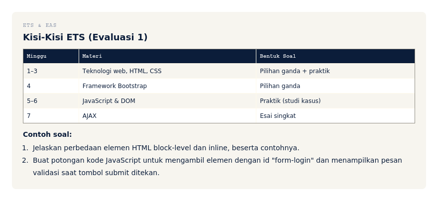

---

### 14. Sesi Sinkron (Live Session)

**Prompt:**
```
Buatkan agenda sesi sinkron (BigBlueButton/Zoom) 90 menit untuk topik
"Membangun Back-End" (minggu 12), dengan pembagian waktu jelas dan sesi
tanya-jawab.
```

**Contoh hasil (HTML siap tempel ke Moodle):**
```html
<div style="background-color:#f7f5ef;border-radius:8px;padding:20px 22px;font-family:Arial, Helvetica, sans-serif;color:#0b1d3a;max-width:820px;">
  <div style="font-family:'Courier New', Courier, monospace;font-size:11px;letter-spacing:1px;text-transform:uppercase;color:#5b6b8c;margin-bottom:6px;">Sesi Sinkron (Live Session)</div>
  <h2 style="font-size:18px;margin:0 0 12px;color:#0b1d3a;">&#128421;&#65039; Minggu 12: Membangun Back-End</h2>
  <p style="font-size:13px;margin:0 0 10px;">Tautan: [BigBlueButton/Zoom link] &middot; Durasi: 90 menit</p>
    <table style="width:100%;border-collapse:collapse;font-size:13px;">
    <tr><td style="padding:4px 10px 4px 0;color:#5b6b8c;font-family:'Courier New',monospace;font-size:12px;">00:00&ndash;10:00</td><td style="padding:4px 0;">Pembukaan &amp; recap materi Front-End</td></tr>
    <tr><td style="padding:4px 10px 4px 0;color:#5b6b8c;font-family:'Courier New',monospace;font-size:12px;">10:00&ndash;40:00</td><td style="padding:4px 0;">Pemaparan struktur Back-End &amp; routing API</td></tr>
    <tr><td style="padding:4px 10px 4px 0;color:#5b6b8c;font-family:'Courier New',monospace;font-size:12px;">40:00&ndash;65:00</td><td style="padding:4px 0;">Demo langsung: membuat endpoint API sederhana</td></tr>
    <tr><td style="padding:4px 10px 4px 0;color:#5b6b8c;font-family:'Courier New',monospace;font-size:12px;">65:00&ndash;80:00</td><td style="padding:4px 0;">Praktik mandiri: menghubungkan endpoint ke front-end</td></tr>
    <tr><td style="padding:4px 10px 4px 0;color:#5b6b8c;font-family:'Courier New',monospace;font-size:12px;">80:00&ndash;90:00</td><td style="padding:4px 0;">Tanya-jawab &amp; pengumuman Tugas 2 (CRUD)</td></tr>
    </table>
</div>
```

**Preview tampilan di myITS Classroom:**

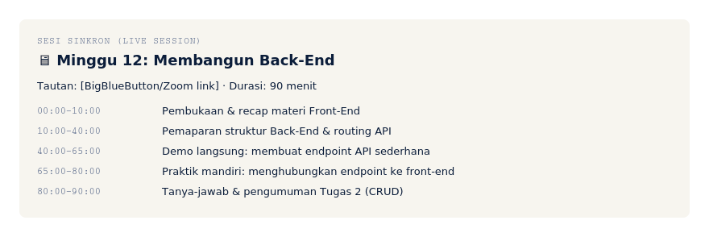

---

### 15. Survei / Umpan Balik

**Prompt:**
```
Buatkan survei umpan balik pembelajaran menjelang akhir semester untuk MK
Pemrograman Web: 3 pertanyaan skala Likert 1–5 dan 2 pertanyaan terbuka,
fokus pada kejelasan materi, kecukupan praktikum, dan saran perbaikan.
```

**Contoh hasil (HTML siap tempel ke Moodle):**
```html
<div style="background-color:#f7f5ef;border-radius:8px;padding:20px 22px;font-family:Arial, Helvetica, sans-serif;color:#0b1d3a;max-width:820px;">
  <div style="font-family:'Courier New', Courier, monospace;font-size:11px;letter-spacing:1px;text-transform:uppercase;color:#5b6b8c;margin-bottom:6px;">Survei / Umpan Balik</div>
  <h2 style="font-size:18px;margin:0 0 12px;color:#0b1d3a;">Survei Umpan Balik Pembelajaran</h2>
  <p style="font-size:14px;margin:0 0 6px;"><b>Skala 1 (Sangat Tidak Setuju) &ndash; 5 (Sangat Setuju):</b></p>
    <ol style="font-size:14px;line-height:1.8;margin:0 0 12px;padding-left:20px;">
    <li>Materi perkuliahan disampaikan dengan jelas dan mudah dipahami.</li>
    <li>Sesi praktikum cukup membantu memahami implementasi teknis.</li>
    <li>Umpan balik atas tugas diberikan tepat waktu dan membantu.</li>
    </ol>
    <p style="font-size:14px;margin:0 0 6px;"><b>Pertanyaan terbuka:</b></p>
    <ol start="4" style="font-size:14px;line-height:1.8;margin:0;padding-left:20px;">
    <li>Bagian materi mana yang menurut Anda paling sulit dipahami? Mengapa?</li>
    <li>Apa saran Anda untuk perbaikan MK ini di semester berikutnya?</li>
    </ol>
</div>
```

**Preview tampilan di myITS Classroom:**

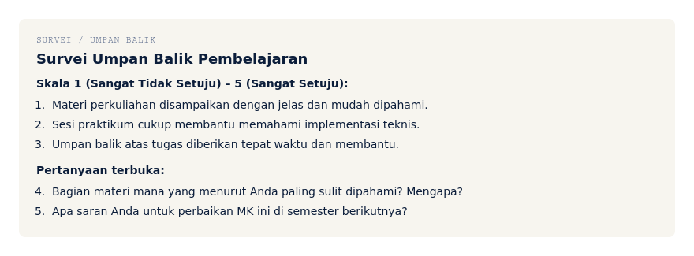

---

## Tips Prompting Efektif

1. **Selalu lampirkan RPS** sebagai konteks di awal percakapan — hasilnya jauh lebih akurat dibanding hanya menyebut nama topik.
2. **Minta format keluaran spesifik** (markdown/tabel/teks polos) agar tidak perlu diformat ulang manual sebelum ditempel ke Moodle.
3. **Untuk referensi/pustaka**, minta AI hanya memberi kata kunci pencarian — jangan minta judul/tautan jadi, karena AI bisa mengarang.
4. **Iterasi per bagian kecil** (per minggu/per komponen) lebih akurat daripada minta AI mengisi seluruh RPS sekaligus.
5. **Verifikasi angka bobot** hasil AI terhadap RPS asli — kesalahan penjumlahan bobot penilaian sering terjadi.
